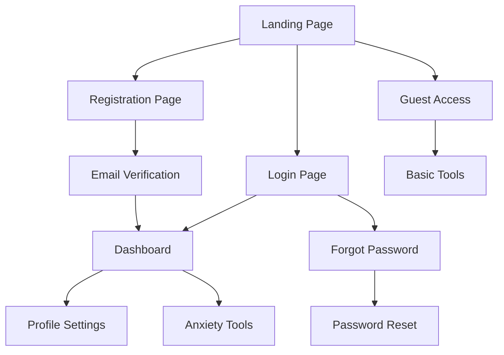

# PanicPal - Mental Health Application Product Requirements Document

## 1. Product Overview
PanicPal is a mental health application specifically designed to assist users during anxiety attacks through calming features and secure user management.
- The application provides immediate support tools and resources for individuals experiencing anxiety, offering a safe digital space for mental health management.
- Target market includes individuals with anxiety disorders, panic disorders, and those seeking preventive mental health tools, with potential to serve millions of users globally.

## 2. Core Features

### 2.1 User Roles
| Role | Registration Method | Core Permissions |
|------|---------------------|------------------|
| Registered User | Email registration with verification | Can access all anxiety support features, save preferences, track progress |
| Guest User | No registration required | Limited access to basic breathing exercises and emergency resources |

### 2.2 Feature Module
Our PanicPal application consists of the following main pages:
1. **Login Page**: secure authentication form, remember me option, password recovery link.
2. **Registration Page**: user signup form, email verification, terms acceptance.
3. **Dashboard**: personalized anxiety management tools, quick access to emergency features.
4. **Profile Settings**: user preferences, account management, privacy controls.

### 2.3 Page Details
| Page Name | Module Name | Feature description |
|-----------|-------------|---------------------|
| Login Page | Authentication Form | Validate email/username and password, implement "Remember me" checkbox, provide "Forgot password" recovery link, secure login button with loading states |
| Login Page | Security Features | Implement rate limiting, CAPTCHA for suspicious activity, secure session management, password strength indicators |
| Registration Page | Signup Form | Collect required fields (name, email, password, confirm password), real-time form validation, password strength meter |
| Registration Page | Terms & Verification | Terms and conditions acceptance checkbox, email verification process, account activation workflow |
| Dashboard | Quick Access Tools | Emergency breathing exercises, panic attack countdown timer, calming audio/visual content, crisis contact buttons |
| Dashboard | Progress Tracking | Mood logging, anxiety level tracking, progress visualization, personalized insights |
| Profile Settings | Account Management | Edit personal information, change password, notification preferences, data export options |
| Profile Settings | Privacy Controls | Data sharing preferences, account deletion, session management, two-factor authentication setup |

## 3. Core Process
**New User Flow:**
Users start by accessing the registration page, complete the signup form with validation, accept terms and conditions, verify their email, and then access the dashboard with personalized anxiety management tools.

**Returning User Flow:**
Existing users access the login page, authenticate with email/password, optionally use "Remember me" for convenience, and proceed directly to their personalized dashboard with saved preferences and progress history.

**Emergency Access Flow:**
Guest users can immediately access basic breathing exercises and emergency resources without registration, while registered users get full access to personalized crisis management tools.

## 4. User Interface Design
### 4.1 Design Style
- **Primary Colors**: Deep teal (#2D5A5A), mint green (#7FDBCA), soft sage (#A8D5BA)
- **Secondary Colors**: Warm white (#F8F9FA), light gray (#E9ECEF), accent coral (#FF6B6B) for alerts
- **Button Style**: Rounded corners (8px radius), soft shadows, gradient backgrounds for primary actions
- **Font**: Inter for headings (16-24px), Open Sans for body text (14-16px), consistent line spacing (1.5)
- **Layout Style**: Card-based design with generous white space, top navigation with hamburger menu, floating action buttons for emergency features
- **Icons**: Minimalist line icons, calming nature-inspired elements (leaves, waves), consistent 24px sizing

### 4.2 Page Design Overview
| Page Name | Module Name | UI Elements |
|-----------|-------------|-------------|
| Login Page | Authentication Form | Centered card layout with teal gradient background, rounded input fields with soft borders, primary button in mint green with hover effects |
| Registration Page | Signup Form | Multi-step form with progress indicator, real-time validation with green checkmarks, calming background with subtle leaf patterns |
| Dashboard | Quick Tools | Grid layout with rounded cards, breathing exercise with animated circles, emergency button with coral accent, progress charts in teal tones |
| Profile Settings | Settings Panel | Clean list layout with toggle switches, profile avatar with upload functionality, section dividers in light gray |

### 4.3 Responsiveness
The application is mobile-first with adaptive design for tablets and desktops, featuring touch-optimized interactions for anxiety management tools, swipe gestures for navigation, and accessibility features including high contrast mode and screen reader compatibility.