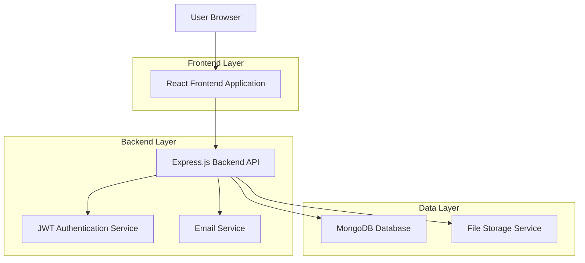
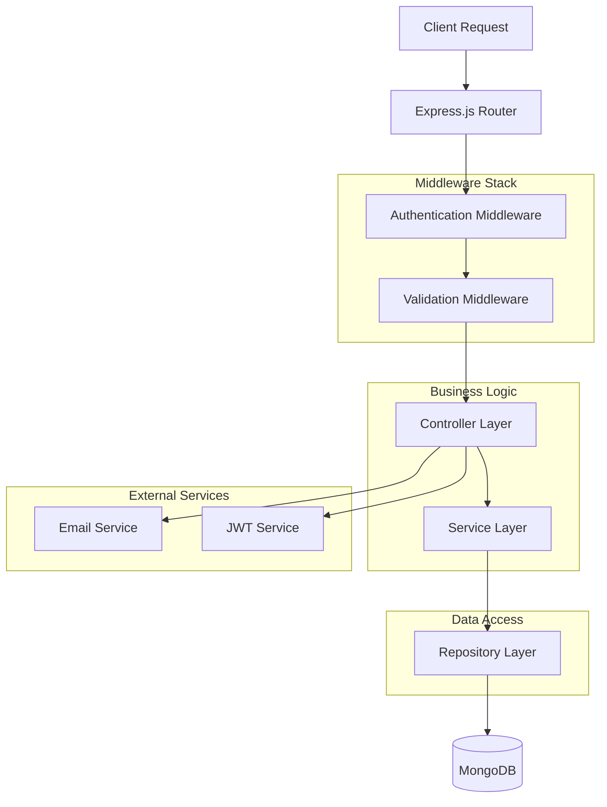
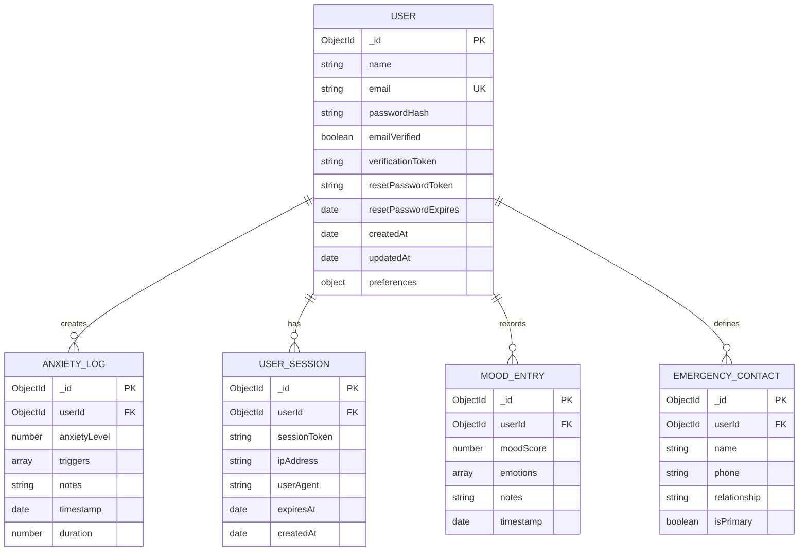

# PanicPal - Technical Architecture Document

## 1. Architecture Design



## 2. Technology Description
- Frontend: React@18 + TypeScript + Tailwind CSS@3 + Vite + React Router + Axios
- Backend: Node.js@18 + Express.js@4 + TypeScript + JWT + bcrypt + nodemailer
- Database: MongoDB@6 + Mongoose ODM
- Authentication: JSON Web Tokens (JWT) + bcrypt for password hashing
- Validation: Joi for server-side validation + React Hook Form for client-side

## 3. Route Definitions
| Route | Purpose |
|-------|---------|
| / | Landing page with app introduction and quick access options |
| /login | User authentication page with secure login form |
| /register | User registration page with form validation |
| /dashboard | Main user dashboard with anxiety management tools |
| /profile | User profile settings and account management |
| /forgot-password | Password recovery initiation page |
| /reset-password/:token | Password reset page with token validation |
| /emergency | Quick access emergency tools for anxiety attacks |

## 4. API Definitions

### 4.1 Core API

**User Authentication**
```
POST /api/auth/register
```

Request:
| Param Name | Param Type | isRequired | Description |
|------------|------------|------------|-------------|
| name | string | true | User's full name (2-50 characters) |
| email | string | true | Valid email address |
| password | string | true | Password (min 8 characters, mixed case, numbers) |
| confirmPassword | string | true | Password confirmation |
| acceptTerms | boolean | true | Terms and conditions acceptance |

Response:
| Param Name | Param Type | Description |
|------------|------------|-------------|
| success | boolean | Registration status |
| message | string | Success or error message |
| userId | string | Generated user ID (on success) |

Example:
```json
{
  "name": "John Doe",
  "email": "john@example.com",
  "password": "SecurePass123",
  "confirmPassword": "SecurePass123",
  "acceptTerms": true
}
```

**User Login**
```
POST /api/auth/login
```

Request:
| Param Name | Param Type | isRequired | Description |
|------------|------------|------------|-------------|
| email | string | true | User's email address |
| password | string | true | User's password |
| rememberMe | boolean | false | Extended session duration |

Response:
| Param Name | Param Type | Description |
|------------|------------|-------------|
| success | boolean | Login status |
| token | string | JWT authentication token |
| user | object | User profile data (excluding password) |
| expiresIn | string | Token expiration time |

**Password Reset Request**
```
POST /api/auth/forgot-password
```

Request:
| Param Name | Param Type | isRequired | Description |
|------------|------------|------------|-------------|
| email | string | true | User's registered email |

Response:
| Param Name | Param Type | Description |
|------------|------------|-------------|
| success | boolean | Request status |
| message | string | Confirmation message |

**User Profile Management**
```
GET /api/user/profile
PUT /api/user/profile
```

Headers:
| Header Name | Value |
|-------------|-------|
| Authorization | Bearer {jwt_token} |

## 5. Server Architecture Diagram



## 6. Data Model

### 6.1 Data Model Definition



### 6.2 Data Definition Language

**User Collection (users)**
```javascript
// MongoDB Schema Definition
const userSchema = new mongoose.Schema({
  name: {
    type: String,
    required: true,
    trim: true,
    minlength: 2,
    maxlength: 50
  },
  email: {
    type: String,
    required: true,
    unique: true,
    lowercase: true,
    validate: [validator.isEmail, 'Invalid email']
  },
  passwordHash: {
    type: String,
    required: true,
    minlength: 60
  },
  emailVerified: {
    type: Boolean,
    default: false
  },
  verificationToken: String,
  resetPasswordToken: String,
  resetPasswordExpires: Date,
  preferences: {
    notifications: {
      email: { type: Boolean, default: true },
      push: { type: Boolean, default: true }
    },
    privacy: {
      shareData: { type: Boolean, default: false },
      publicProfile: { type: Boolean, default: false }
    },
    accessibility: {
      highContrast: { type: Boolean, default: false },
      largeText: { type: Boolean, default: false }
    }
  }
}, {
  timestamps: true
});

// Indexes
userSchema.index({ email: 1 });
userSchema.index({ verificationToken: 1 });
userSchema.index({ resetPasswordToken: 1 });
```

**Anxiety Log Collection (anxiety_logs)**
```javascript
const anxietyLogSchema = new mongoose.Schema({
  userId: {
    type: mongoose.Schema.Types.ObjectId,
    ref: 'User',
    required: true
  },
  anxietyLevel: {
    type: Number,
    required: true,
    min: 1,
    max: 10
  },
  triggers: [{
    type: String,
    enum: ['work', 'social', 'health', 'financial', 'family', 'other']
  }],
  notes: {
    type: String,
    maxlength: 500
  },
  duration: {
    type: Number, // in minutes
    min: 0
  },
  timestamp: {
    type: Date,
    default: Date.now
  }
});

// Indexes
anxietyLogSchema.index({ userId: 1, timestamp: -1 });
anxietyLogSchema.index({ timestamp: -1 });
```

**Initial Data Setup**
```javascript
// Default user preferences
const defaultPreferences = {
  notifications: { email: true, push: true },
  privacy: { shareData: false, publicProfile: false },
  accessibility: { highContrast: false, largeText: false }
};

// Sample anxiety triggers for dropdown
const anxietyTriggers = [
  'work', 'social', 'health', 'financial', 
  'family', 'relationships', 'academic', 'other'
];
```